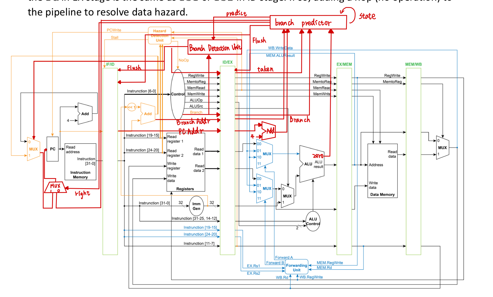

## 2.1 Modules Explanation
* Adder.v
        
    Adder 模組接收 2 個 32-bit 輸入，src1_i 和 src2_i，並產生 1 個 32-bit 的輸出 adder_o。模組使用 assign 語句將 adder_o 設為 src1_i 和 src2_i 的總和。因此，Adder 模組實現了 32-bit 的加法功能。

* ALU_Control.v

    ALU_Control 模組讀取來自指令的 funct7 和 funct3 的部分以及 ALU 運算類型（ALUOp），並輸出 ALU 操作碼（op_o）。根據 ALUOp、funct7、funct3 的組合，模組使用一系列的 case 語句來確定 ALU 的實際操作。這個模組支援 I-type、R-type、lw/sw、和 beq 四種不同類型，並根據指令的不同選擇相應的 ALU 操作碼。由於 lw/sw 在 ALU 中是使用加法來確定 address，因此 ALU_Control 模組在 lw/sw 的情況下會將 ALU 操作碼設跟 add 和 addi 指令相同的 ALU 操作碼；而 beq 在 ALU 中是使用減法來確定 rs1 和 rs2 是否相等，因此 ALU_Control 模組在 beq 的情況下會將 ALU 操作碼設跟 sub 指令相同的 ALU 操作碼。

    |     op    | 指令類型  |
    | :---------: | :------: |
    |     000     |   and    |
    |     001     |   xor    |
    |     010     |   sll    |
    |     011     |   add、addi、 lw/sw|
    |     100     |   sub、beq    |
    |     101     |   mul    |
    |     111     |   srai   |

* ALU.v

    ALU 模組包含操作碼（op_i）、兩個操作數（src1_i 和 src2_i）作為輸入以及 ALU 結果（data_o）和 zero_o 作為輸出。該模組根據操作碼的值執行不同的運算。例如，當操作碼為 3'b011 時，執行加法操作，將 src1_i 和 src2_i 相加，結果存儲在 data_o 中。

    額外檢查 data_o 是否為 0，若為 0，將 zero_o 設置為 1，否則為 0。這是為了檢查 beq 指令是否應該跳轉。

* Branch_Detection_Unit.v
    Branch_Detection_Unit 模組接收 1 個 Branch_i 以及 predict_i 作為輸入，並輸出 1-bit 的 flush_o。

    Branch_i 是來自 contorl 的輸出，判斷在 ID 階段是否為分支指令，若為 1，則表示在 ID 階段為分支指令，反之，則為 0。

    而 predict_i 是來自 branch_predictor 模組的輸出，表示下一個分支指令是否要直接採用，若為 1，則表示下一個分支指令直接採用，反之則為 0。 
    
    若 Branch_i 和 predict_i 皆為 1 則代表要直接採用 branch 的指令，因此 Branch_Detection_Unit 模組會將 flush_o 設為 1，表示需要清空 IF/ID register 內的資料。反之，則為 0。

* branch_predictor.v
    branch_predictor 模組，根據輸入的信號和歷史狀態，預測分支是否被執行以及分支目標地址。

    模組包含以下輸入和輸出：
    輸入：
    - clk_i
    - rst_i
    - zero_i: 確認 ALU 輸出是否為 0
    - Branch_i: 確認在 EXE 階段是否為分支指令
    - taken_i: 分支是否已被執行
    - PCAddr_i: 分支指令的地址再加上 4
    - BranchAddr_i: 分支目標地址
    - state_reg_i: 當前狀態
    輸出：
    - AddrResult_o: 為「分支指令的地址再加上 4 」或者「分支目標地址」
    - right_o: 預測是否正確
    - predict_o: 下次是否採用分支指令
    - flush_o: 是否清空 ID/EX register 和 IF/ID register 內的資料
    - state_reg_o: 下一個狀態

    state_reg 有 STRONGLY_NOT_TAKEN、WEAKLY_NOT_TAKEN、WEAKLY_TAKEN 和 STRONGLY_TAKEN 四種狀態。
    
    根據 Branch_i、taken_i 和 zero_i 的條件，來判斷先前預測是否正確。
    
    |Branch_i|taken_i|zero_i|right_o|
    |:-:|:-:|:-:|:-:|
    |0|0|0|1|
    |0|0|1|0|
    |0|1|0|1|
    |0|1|1|0|
    |1|0|0|1|
    |1|0|1|0|
    |1|1|0|0|
    |1|1|1|1|
    
    若是正確則 flush_o 為 0，反之，則為 1 。並且在加上當前狀態（state_reg_i）的條件來決定下一個狀態，狀態變更規則遵守 2-bit Dynamic Branch Predictor 的規則。

    如果當前狀態為 STRONGLY_NOT_TAKEN，而預測正確，則下一個狀態為 STRONGLY_NOT_TAKEN；如果當前狀態為 STRONGLY_NOT_TAKEN，而預測錯誤，則下一個狀態為 WEAKLY_NOT_TAKEN；如果當前狀態為 WEAKLY_NOT_TAKEN，而預測正確，則下一個狀態為 STRONGLY_NOT_TAKEN；如果當前狀態為 WEAKLY_NOT_TAKEN，而預測錯誤，則下一個狀態為 WEAKLY_TAKEN；如果當前狀態為 WEAKLY_TAKEN，而預測正確，則下一個狀態為 STRONGLY_TAKEN；如果當前狀態為 WEAKLY_TAKEN，而預測錯誤，則下一個狀態為 WEAKLY_NOT_TAKEN；如果當前狀態為 STRONGLY_TAKEN，而預測正確，則下一個狀態為 STRONGLY_TAKEN；如果當前狀態為 STRONGLY_TAKEN，而預測錯誤，則下一個狀態為 WEAKLY_TAKEN。

* Control.v
        
    Control 模組接收 1-bit 的 NoOp 信號和 7-bit 的 opcode 信號作為輸入，並產生 8 個控制信號作為輸出。當 NoOp 信號為 1 時，表示是 No Operation，則所有控制信號皆設為零；反之，根據 opcode 的值進行不同的設定。

    8 個控制信號作用如下：

    * ALUOp_o：這是一個 2-bit 的信號，表示 ALU（算術邏輯單元）的操作類型。根據不同的指令類型，設定 ALUOp_o 的值。

        |   指令類型   |  ALUOp_o |
        | :---------: | :------: |
        |     I-type  |   00     |
        |     R-type  |   01     |
        |     lw/sw   |   10     |
        |     beq     |   11     |

    * ALUSrc_o：這是一個 1-bit 信號，指示 ALU 的輸入選擇。當 ALUSrc_o 為 1 時，表示 ALU 的輸入來自指令中的常數（immediate）；反之，則來自第二個來源（rs2）。

    * RegWrite_o：這是一個 1-bit 信號，表示是否對寄存器進行寫入。僅在 store 指令（sw）和 branch 指令（beq）時為 0。

    * MemtoReg_o：這是一個 1-bit 信號，表示是否將記憶體的值寫回寄存器。僅在 load 指令（lw）時為 1。

    * MemRead_o：這是一個 1-bit 信號，表示是否從記憶體中讀取數據。僅在 load 指令（lw）時為 1。

    * MemWrite_o：這是一個 1-bit 信號，表示是否將數據寫入記憶體。僅在 store 指令（sw）時為 1。

    * Branch_o：這是一個 1-bit 信號，表示當前指令是否是 branch 指令（beq）。僅在 branch 指令（beq）時為 1。

    根據指令的不同類型，Control 模組將這些控制信號設置為適當的值，以指導 pipeline 中的各個模組執行正確的操作。

* Forwarding_Unit.v

    Forwarding_Unit 模組的作用是處理 data forwarding 的邏輯，以解 data hazard 的問題。此模組接收來自 MEM 和 WB 階段的控制信號（RegWrite）和要寫回寄存器中的數據地址以及 ID/EX pipeline 的寄存器的來源寄存器號碼（rs1、rs2），並生成兩個輸出信號 ForwardA_o 和 ForwardB_o，這兩個信號用於指示應該選擇甚麼值傳入給 ALU。

    Forwarding_Unit 模組的運作邏輯是透過一系列條件判斷來確定是否有必要進行 data forwarding。具體來說：

    * 對於 ForwardA_o，首先檢查 EX 階段是否有寫入記憶體（EX_MEM_RegWrite_i = 1），並且目標寄存器不是 0（EX_MEM_RDaddr_i != 0），同時目標寄存器地址等於取指令階段的第一個來源寄存器地址（ID_EX_RS1addr_i）。如果這些條件滿足，則將 ForwardA_o 設置為 2'b10，表示需進行 MEM 階段到 EX 階段的 data forwarding，將此時 MEM 階段中的 ALUResult 作為此時 EX 階段中 ALU 計算的第一個來源。

    * 如果上述條件不滿足，則進一步檢查 MEM 階段是否有需要將資料寫回寄存器（MEM_WB_RegWrite_i = 1），目標寄存器不是零（MEM_WB_RDaddr_i != 0），並且不同於 EX 階段的 RegWrite，同時目標寄存器地址等於 EX 階段的第一個來源寄存器地址（ID_EX_RS1addr_i）。如果這些條件滿足，則 ForwardA_o 設置為 2'b01，表示需進行 WB 階段到 EX 階段的 data forwarding，將此時 WB 階段中的 MUXResult 作為此時 EX 階段中 ALU 計算的第一個來源。

    * 如果以上條件都不滿足，則將 ForwardA_o 設置為 2'b00，表示不進行 data forwarding。

    對於 ForwardB_o 的判斷過程類似，只是將相應的信號和地址應用於第二個來源寄存器。這樣，Forwarding_Unit 模組確保在 data hazard 的情況下，系統能夠正確地執行指令。

* Hazard_Detection_Unit.v

    Hazard_Detection_Unit 模組包主要用於檢測 pipeline 中的 load use data hazard。以下是該模組的解釋：

    Hazard_Detection_Unit 模組讀取重設信號（rst_i）、兩個來源寄存器的地址（RS1addr_i 和 RS2addr_i）、執行階段的目的寄存器地址（ID_EX_RDaddr_i）以及執行階段的記憶體讀取控制信號（ID_EX_MemRead_i）作為輸入。它產生三個輸出信號：NoOp_o、Stall_o 和 PCWrite_o。

    模組使用條件語句來定義輸出信號。如果重設信號（rst_i）設為 0，模組將產生預設值，即 NoOp_o 為 0、Stall_o 為 0、PCWrite_o 為 1。這表示在重設時，模組不會引發任何操作的中斷，並允許 PC 的寫入。

    如果 ID_EX_MemRead_i 為 1，且 RS1 或 RS2 的地址等於 ID_EX_RDaddr_i，這表示有 load use data hazard 產生，則 pipeline 需產生 Stall（Stall_o = 1）並且不執行任何操作（NoOp_o = 1），同時禁止 PC 的寫入（PCWrite_o = 0）。

    如果以上條件都不滿足，模組將生成默認值，確保 NoOp_o 為 0、Stall_o 為 0，並允許 PC 的寫入（PCWrite_o 為 1）。這表示在這種情況下， pipeline 不受阻塞，並且可以正常執行操作。

* Imm_Gen.v

    Imm_Gen 模組是一個產生常數（Immediate）的模組。它接收 32-bit 的指令（instr_i）作為輸入並生成一個 32-bit 的常數（imm_o）。根據不同的指令的 opcode（操作碼）（instr_i[6:0]），模組從指令不同的位元產生該指令要用的常數。具體來說：

    如果 opcode 是 7'b0100011，代表這是一條 store 指令（sw），那麼模組會將 imm_o 設置為 {{20{instr_i[31]}}, instr_i[31:25], instr_i[11:7]}}。這將從 instr_i 中取得相應的位元組成常數，並使用 instr_i[31] 來填充最高位元（sign extend）。

    如果 opcode 是 7'b1100011，代表這是一條 branch equal 指令（beq），那麼模組會將 imm_o 設置為 {{20{instr_i[31]}}, instr_i[31], instr_i[7], instr_i[30:25], instr_i[11:8]}}。同樣地，這將從 instr_i 中取得相應的位元組成常數，並使用 instr_i[31] 來填充最高位元（sign extend）。

    對於其他操作碼，模組會將 imm_o 設置為 {{20{instr_i[31]}}, instr_i[31:20]}}。這是處理其他指令的默認情況。

* MUX32_Forwarding.v

    MUX32_Forwarding 模組包含 4 個輸入：2-bit 的 sel（選擇位元）、32-bit 的 src1_i、32-bit 的 src2_i、32-bit 的 src3_i，以及一個輸出 32-bit 的 mux_o。用來處理 data forwarding 時選擇的數據。

    選擇位元 sel 用來指示要選擇的輸入數據。根據不同的 sel 值，模組會選擇其中一個輸入作為輸出。

    * 當 sel = 00 時，mux_o 的輸出是 src1_i。
    * 當 sel = 01 時，mux_o 的輸出是 src2_i。
    * 當 sel 不是上述情況時，mux_o 的輸出是 src3_i。

* MUX32.v
    
    MUX32_Forwarding 模組包含 3 個輸入：1-bit 的 sel（選擇位元）、32-bit 的 src1_i、32-bit 的 src2_i 以及一個輸出 32-bit 的 mux_o。

    選擇位元 sel 用來指示要選擇的輸入數據。根據不同的 sel 值，模組會選擇其中一個輸入作為輸出。

    * 當 sel = 0 時，mux_o 的輸出是 src1_i。
    * 當 sel = 1 時，mux_o 的輸出是 src2_i。

* IF_ID_Register.v

    IF_ID_Register 模組接收時脈信號（clk_i）、重設信號（rst_i）、flush 信號、Stall 信號、指令輸入（instr_i）、PC 輸入（PC_i），並輸出指令（instr_o）和 PC（PC_o）。該模組在時脈信號上升或重設信號下降時進行操作。

    * 當重設信號為 0 時，模組將輸出指令和 PC 都設為 0。
    * 當 flush 信號為 1 時，表示需要清空 IF_ID_Register，同樣將輸出指令和 PC 設為 0。
    * 當 Stall 信號為 1 時，模組保持原狀態，不進行任何操作。
    * 在正常情況下，當沒有重設或清空信號時，模組將輸入的指令（instr_i）和 PC（PC_i）複製到輸出的指令（instr_o）和 PC（PC_o）。

* ID_EX_Register.v

    ID_EX_Register 模組接收時脈信號（clk_i）、重設信號（rst_i）、6 個控制信號（RegWrite_i、MemtoReg、MemRead、MemWrite、ALUOp、ALUSrc）、RS1 資料、RS2 資料、常數（immediate_i）、func7、func3、RS1 位址、RS2 位址、RD 位址、taken、Branch、BranchAddr、PCAddr 輸入以及 flush 信號輸入，除了時脈信號（clk_i）、重設信號（rst_i）、flush 外，其餘信號皆有對應輸出。該模組在時脈信號上升或重設信號下降時進行操作。

    * 當重設信號為 0 時，模組將輸出都設為 0。
    * 當 flush 信號為 1 時，表示需要清空 ID_EX_Register，將輸出都設為 0。
    * 其餘情況下，模組將輸入複製到對應的輸出。

* EX_MEM_Register.v

    EX_MEM_Register 模組接收時脈信號（clk_i）、重設信號（rst_i）、4 個控制信號（RegWrite_i、MemtoReg、MemRead、MemWrite）、ALU 計算結果（ALUResult_i）、ForwardB 資料、RD 位址等輸入，其中時脈信號（clk_i）、重設信號（rst_i）是輸入，其餘信號皆有對應輸出。該模組在時脈信號上升或重設信號下降時進行操作。

    * 當重設信號為 0 時，模組將輸出都設為 0。
    * 在正常情況下，當沒有重設信號時，模組將輸入複製到對應的輸出。

* MEM_WB_Register.v

    MEM_WB_Register 模組接收時脈信號（clk_i）、重設信號（rst_i）、2 個控制信號（RegWrite_i、MemtoReg_i）、ALU 計算結果（ALUResult_i）、記憶體資料（MemData_i）、RD 位址等輸入，除了時脈信號（clk_i）、重設信號（rst_i）外，其餘信號皆有對應輸出。該模組在時脈信號上升或重設信號下降時進行操作。

    * 當重設信號為 0 時，模組將輸出都設為 0。
    * 在正常情況下，當沒有重設信號時，模組將輸入複製到對應的輸出。

* CPU.v

    
    CPU 模組依照上述的 Data path 組成 pipeline CPU，每個 pipeline register 由一個模組表示，並以 pipeline 方式執行指令。以下是主要模組及其功能的解釋：

    * IF_ID_Register：

        * 目的：表示指令提取（IF）和指令解碼（ID）階段之間的 pipeline 寄存器。
        * 輸入：clk_i，rst_i，(ID_FlushIF || EX_FlushID_IF)，Stall，instr，pc_o
        * 輸出：IF_ID_instr，IF_ID_PC
        * 透過 (ID_FlushIF || EX_FlushID_IF) 信號來判斷是否要清空寄存器。

    * ID_EX_Register：

        * 目的：表示指令解碼（ID）和執行（EX）階段之間的 pipeline 寄存器。
        * 輸入：clk_i，rst_i，EX_FlushID_IF，控制信號，來自 IF_ID_Register 的數據
        * 輸出：控制信號，ALU 操作的數據，寄存器數據等，供 EX 階段使用。
        * 透過 EX_FlushID_IF 信號來判斷是否要清空寄存器。

    * EX_MEM_Register：

        * 目的：表示執行（EX）和存儲器（MEM）階段之間的 pipeline 寄存器。
        * 輸入：clk_i，rst_i，控制信號，來自 ID_EX_Register 的數據
        * 輸出：控制信號，ALU 結果，供 MEM 階段使用的數據。
    * MEM_WB_Register：

        * 目的：表示存儲器（MEM）和寫回（WB）階段之間的 pipeline 寄存器。
        * 輸入：clk_i，rst_i，控制信號，來自 EX_MEM_Register 的數據
        * 輸出：控制信號，ALU結果，供 WB 階段使用的數據。

    * MUX32_PC：

        * 目的：選擇刷新的指令和分支地址之間，以確定下一個PC值。
        * 輸入：ID_FlushIF，pc_i，branchAddr
        * 輸出：muxPCResult
        * 透過 ID_FlushIF 信號來判斷是否要刷新指令。

    * MUX32_PC2：

        * 目的：選擇 MUX32_PC 的輸出結果和 branch_predictor 的輸出地址，以確定下一個PC值。
        * 輸入：right，AddrResult，muxPCResult
        * 輸出：muxPCResult2
        * 透過 right 信號來判斷是否要採用 branch_predictor 的輸出地址。

    * PC：

        * 目的：表示程序計數器模組，負責管理程序計數器。
        * 輸入：clk_i，rst_i，PCWrite，muxPCResult2
        * 輸出：pc_o

    * Adder（Add）：

        * 目的：添加兩個值，用於計算下一個 PC 地址。
        * 輸入：pc_o，'d4
        * 輸出：pc_i

    * Adder（Add2）：

        * 目的：添加兩個值，用於計算分支目標地址。
        * 輸入：(immediate << 1)，IF_ID_PC
        * 輸出：branchAddr

    * Adder（Add3）：

        * 目的：添加兩個值，用於計算在 EXE 階段的分支指令的下一個 PC 地址。
        * 輸入：ID_EX_PCAddr，'d4
        * 輸出：EX_PCAddr

    * Instruction_Memory：

        * 目的：表示指令存儲器，根據提供的地址提取指令。
        * 輸入：pc_o
        * 輸出：instr

    * Hazard_Detection_Unit：

        * 目的：檢測 pipeline 中的 hazard（例如，data hazard）並生成控制信號。
        * 輸入：與指令和 pipeline 階段相關的各種信號
        * 輸出：NoOp，Stall，PCWrite
    * Control：

        * 目的：根據指令的操作碼生成控制信號。
        * 輸入：NoOp，opcode_i
        * 輸出： pipeline 階段的各種控制信號。
    * Registers：

        * 目的：表示寄存器文件，處理讀寫操作。
        * 輸入：與指令和 pipeline 階段相關的各種信號
        * 輸出：RS1data_o，RS2data_o
    * Branch_Detection_Unit：

        * 目的：檢測分支並生成控制信號。
        * 輸入：take_branch，Branch
        * 輸出：ID_FlushIF
    * Imm_Gen：

        * 目的：根據指令生成即時值。
        * 輸入：IF_ID_instr
        * 輸出：immediate
    * Forwarding_Unit：

        * 目的：確定 data forwarding 路徑。
        * 輸入：與指令和 pipeline 階段相關的各種信號
        * 輸出：ForwardA，ForwardB
    * MUX32_ForwardA/MUX32_ForwardB：

        * 目的：根據 forwarding 信號選擇適當的數據來源。
        * 輸入：ForwardA/ForwardB，數據來源
        * 輸出：ForwardAData，ForwardBData
    * MUX：

        * 目的：選擇 ALU 輸入的數據來源。
        * 輸入：ID_EX_ALUSrc，數據來源
        * 輸出：MUXResult
    * ALU_Control：

        * 目的：根據控制信號確定 ALU 操作。
        * 輸入：與指令和 pipeline 階段相關的各種信號
        * 輸出：operation
    * ALU：

        * 目的：執行算術和邏輯操作。
        * 輸入：operation，數據來源
        * 輸出：ALUResult，zero
        * zero 信號用於判斷結果是否為 0。

    * Data_Memory：

        * 目的：表示數據存儲器，處理讀寫操作。
        * 輸入：與指令和 pipeline 階段相關的各種信號
        * 輸出：MemData

    * MUX2：

        * 目的：根據 MEM_WB_MemtoReg 選擇 ALU 結果和存儲器數據的寫回。
        * 輸入：MEM_WB_MemtoReg，數據來源
        * 輸出：RDdata

    這些模組共同構成一個基本的 pipeline CPU，具有動態預測分支、hazard 檢測、控制單元、data forwarding 和存儲器操作。pipeline 階段包括指令提取（IF）、指令解碼（ID）、執行（EX）、存儲器（MEM）和寫回（WB）。

## 2.2. Difficulties Encountered and Solutions in This Lab

* 因為這次沒有提供 data path 的圖，原本我憑著感覺寫，但是後來發現有些邏輯錯誤，觀察助教提供的結果後，才發現是要到 ID 階段才會判斷是否要拿分支的目標地址，不然原本我認為應該要在 IF 階段就判斷。後來就根據這個想法，先畫出 data path 的圖，再來寫程式，就比較順利了。

## 2.3 Development Environment
* OS: WSL2 (Windows Subsystem for Linux version 2), Linux distro: Ubuntu 22.04.5 LTS
* compiler: iverilog version 11.0
* IDE: Visual Studio Code